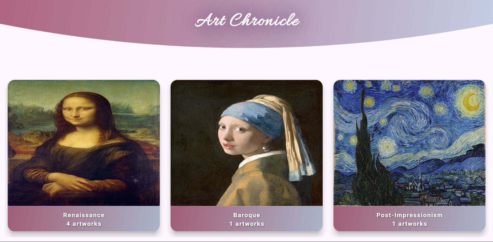
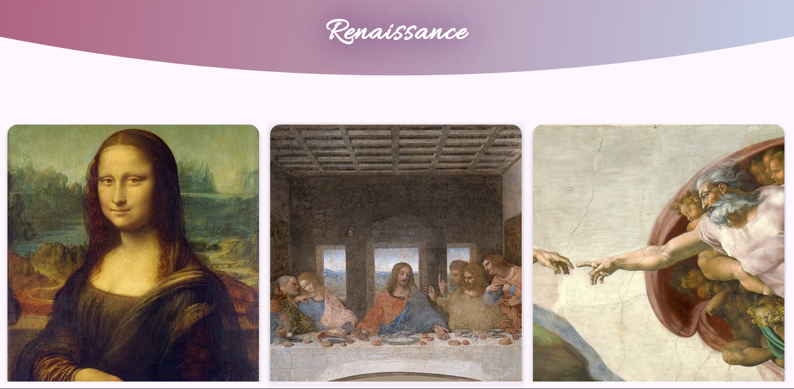
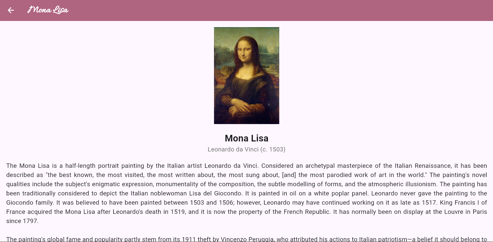

# 🖼️ Art Chronicle 🎨

**Art Chronicle** is a beautiful Flutter app that showcases famous artworks from various artistic movements like Renaissance, Baroque, Impressionism, Surrealism, and more. Users can browse art categories, tap on a category to view featured artworks, and read descriptions with high-quality images.

---

## 📸 Features

- 📚 Categorized artworks by major art movements
- 🖼️ Image-rich grid view with smooth design
- 🧠 Tap to explore artwork details
- 🌈 Custom gradient UI with elegant fonts
- 📱 Responsive layout for all screen sizes

---

## 📂 Project Structure

```bash
art_app/
├── assets/
│   └── images/              # All artwork images (e.g., mona_lisa.jpg)
├── lib/
│   ├── constant.dart        # Contains `artData` JSON
│   ├── home_page.dart       # Main UI with grid view of categories
│   ├── art_details.dart     # Detail screen for each art category
│   ├── artwork_view.dart    # Details screen for each art piece with their details 
│   └── main.dart            # Entry point of the app
├── pubspec.yaml             # Dependencies and assets list
└── README.md                # You're here!
```

---
---

## 📱 Screenshots
**Home Screen**<br>
 

**Art Category Details Screen**<br>
 

**Artwork Details Screen**<br>
 

---

## 🛠️ Setup Instructions

**Clone this repo**
```bash
git clone https://github.com/elmahtoasean/art_app.git
cd art_app
```

**Install dependencies**
```bash
flutter pub get
```

**Add assets**
- Place your artwork images in `assets/images/`
- Ensure file names match those in your `constant.dart`

**Run the app**
```bash
flutter run
```